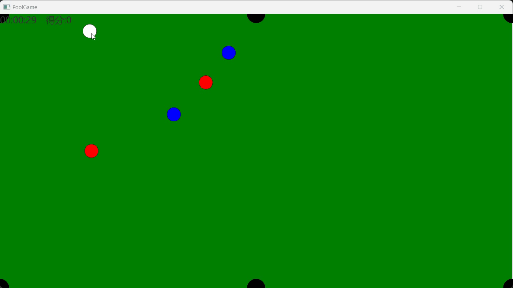

# 桌球游戏

## 作者

[https://github.com/SnowyTulip/PoolGame2](https://github.com/SnowyTulip/PoolGame2)

## 使用声明

遵循开源协议 [WTFPL](https://zh.wikipedia.org/wiki/WTFPL)

## 命令说明

- 运行 `gradle run` 将使用 `resources` 文件夹中的默认配置文件。使用 `gradle run --args="${CONFIG_PATH}"` 来加载自定义配置文件。
- 运行 `gradle javadoc` 可以生成自动文档。

### Features

#### 1 修正物理引擎

使用真实物理摩擦力公式修正速度

#### 2 击球轨迹预测

使用公式计算轨迹落点

#### 3 击球动画优化

设置碰撞箱体，球杆拥有运动轨迹

#### 4 图形优化，解决绿球显示的问题

#### 5 优化游戏胜利、游戏失败提示

#### 6 难度控制选择

A 点击ESC键换出菜单，并暂停游戏

#### 7 回合设置

回合策略：当一次击球开始时记为回合i开始

回合开始后所有球都停止运动记为回合结束

#### 8 计时与得分

得分与计时均可回滚

